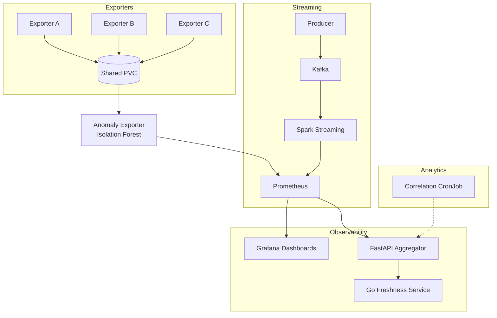

# Sardaruddin Syed

Software Engineer | AI Systems, Distributed Infrastructure & Observability

I design distributed backend systems with strong emphasis on telemetry, monitoring, and reliable operation in containerised environments. My work centers on streaming pipelines, time-series validation, and infrastructure that remains observable under scale and constraint.

---

## Engineering Focus

- Distributed telemetry architectures  
- Streaming data pipelines (Kafka, Spark Structured Streaming)  
- Time-series validation and metric integrity  
- Observability with Prometheus and Grafana  
- Container-native deployment (Docker, Kubernetes, OpenShift)  
- Deterministic system behaviour and explicit state management  

---

## Featured System: Distributed Transfer Monitoring Platform

A containerised distributed monitoring system simulating multi-site data transfers across heterogeneous infrastructure.

The platform integrates Kafka-based ingestion, Spark Structured Streaming aggregation, and Python-based Prometheus exporters to generate and validate telemetry in near real time. Automated cross-metric consistency checks ensure exported monitoring data accurately reflects processed events.

Anomaly detection is applied to surface abnormal transfer behaviour as structured monitoring signals. The system is deployed on Kubernetes/OpenShift and designed to operate under constrained resource environments, emphasizing reproducibility, metric integrity, and operational visibility.

🔗 Repository: [github.com/iamakamen/dtms-platform](https://github.com/iamakamen/dtms-platform)

---

## Approach to System Design

- Validate metrics before visualisation  
- Prefer deterministic behaviour over implicit state  
- Design clear service boundaries and observable interfaces  
- Automate infrastructure for reproducibility  
- Treat monitoring as a first-class engineering concern  

---

## Technology Stack

Python, Java, Go, SQL  
Apache Kafka  
Spark Structured Streaming  
Prometheus & Grafana  
Docker & Kubernetes  
Linux  

---

## Contact

LinkedIn: [linkedin.com/in/iamakamen](https://www.linkedin.com/in/iamakamen/)  
Email: [iamakamen@duck.com](mailto:iamakamen@duck.com)  
